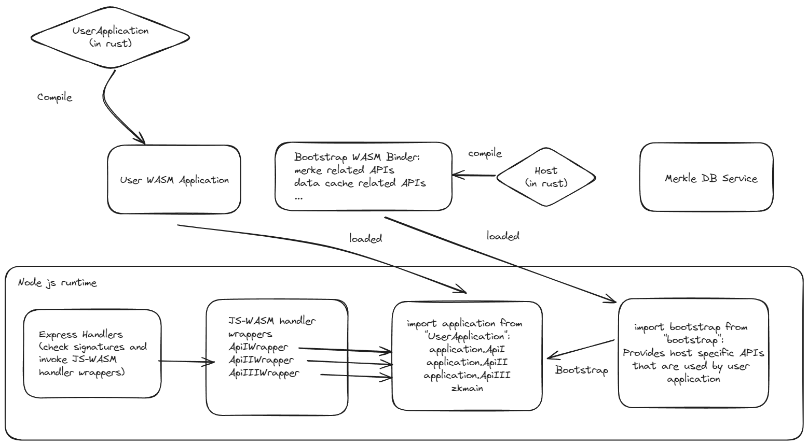

# A typescript mini server for ZKWASM server side application

## How to use

1. Start Redis
```
sudo add-apt-repository ppa:redislabs/redis
sudo apt-get update
redis-server
```

2. Start Mongodb
```
mkdir db
mongod --dbpath db
```

3. Start dbservice
```
./dbservice >>> cargo run --release
```

4. make build
```
./host >>> make build
./example >>> make build
```

5. Start service
```
./ts >>> npm install
./ts >>> npx tsc
./ts >>> node src/service.js
```

6. Run test
```
./ts >>> node src/test.js
```

## Architecture


## Invoke ZKWASM cloud
