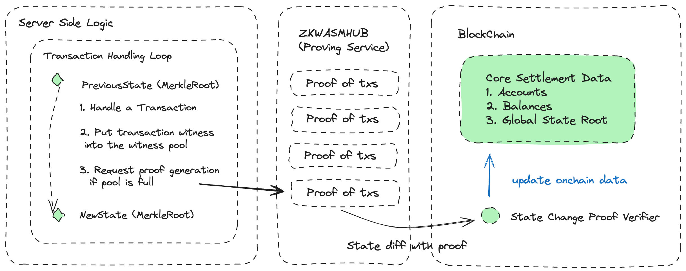
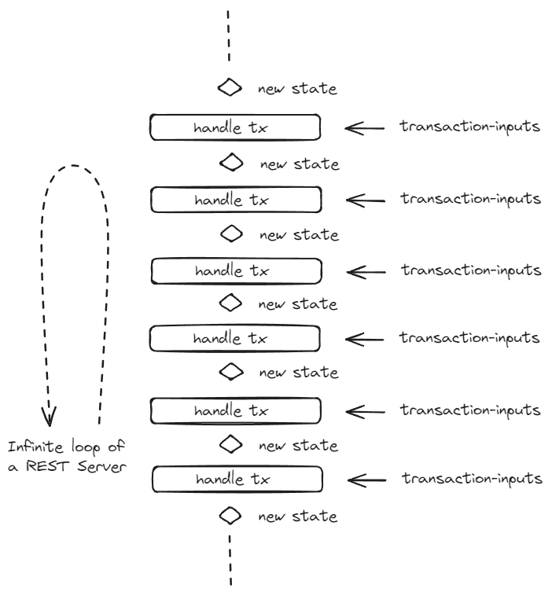
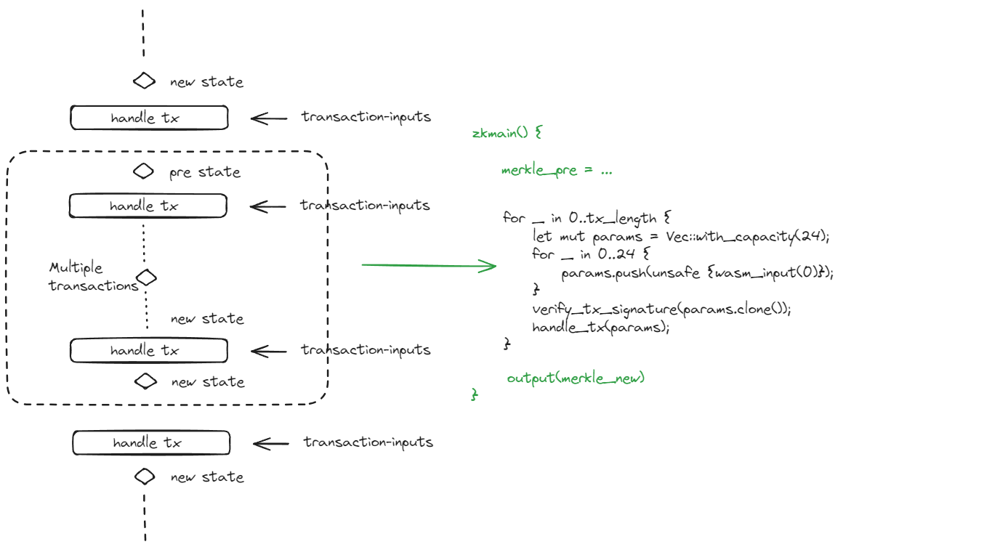
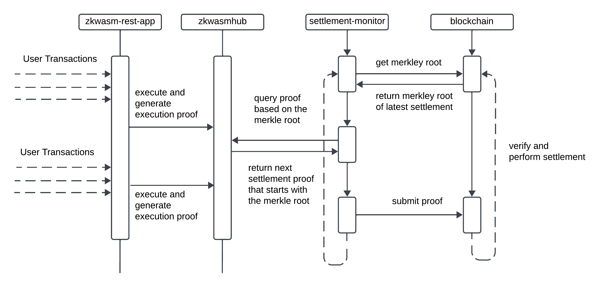

# A typescript mini server for ZKWASM server side application

This repo is a sample REST service in Rust which is compiled to WASM and runs in nodejs. The external running environment is described in the following picture where the left most component is our mini-rest-server.


The trustless part is the transaction handling part whose execution is proved using the ZKWASM proving service (the middle component in the graph) and the final proofs are verified onchain with settlement callbacks.

## Put the endless REST server login written in typescript into ZKWASM

1. The nature logic:


2. The bundled logic:


## Verifiable Application Template

In this repo, we provide a template in `abi/src/lib.rs` which implements the bundled logic within the function `zkmain`. The template has the following pseudo code structure:
```
#[wasm_bindgen]
    pub fn zkmain() {
        use zkwasm_rust_sdk::wasm_input;
        use zkwasm_rust_sdk::wasm_output;
        use zkwasm_rust_sdk::wasm_trace_size;
        let merkle_ref = unsafe {&mut MERKLE_MAP};
        let tx_length = unsafe {wasm_input(0)};

        unsafe {
            initialize([wasm_input(1), wasm_input(1), wasm_input(1), wasm_input(1)].to_vec())
        }

        let trace = unsafe {wasm_trace_size()};
        zkwasm_rust_sdk::dbg!("trace after initialize: {}\n", trace);

        for _ in 0..tx_length {
            let mut params = Vec::with_capacity(24);
            for _ in 0..24 {
                params.push(unsafe {wasm_input(0)});
            }
            verify_tx_signature(params.clone());
            handle_tx(params);
            let trace = unsafe {wasm_trace_size()};
            zkwasm_rust_sdk::dbg!("trace track: {}\n", trace);
        }


        unsafe { zkwasm_rust_sdk::require(preempt()) };

        let bytes = $S::flush_settlement();
        let txdata = conclude_tx_info(bytes.as_slice());

        let root = merkle_ref.merkle.root;
        unsafe {
            wasm_output(root[0]);
            wasm_output(root[1]);
            wasm_output(root[2]);
            wasm_output(root[3]);
        }

        unsafe {
            wasm_output(txdata[0]);
            wasm_output(txdata[1]);
            wasm_output(txdata[2]);
            wasm_output(txdata[3]);
        }
    }
}
```
At the beginning of each chunk, the state is initialized. After the initialization, an array of transactions are handled until the state reaches its preemption point. After the preemption point is reached, the state is stored and the bundle outputs the new merkle root which will be used for the following bundle. Based on this template, it remains to implementing a few APIs for the whole application to work as a rollup.

## Rest service ABI convention:
The convention between the sequencer (implemented in typescript) and the provable application contains three parts.
1. The transaction APIs.
2. The state initializer and querying APIs.
3. The configuration APIs

In the template, `T` is the transaction trait, `S` is the state trait and `C` is the configuration trait.
```
macro_rules! create_zkwasm_apis {
    ($T: ident, $S: ident, $C: ident) => {
        ....
    }
}
```

### Transaction based API:
```
    #[wasm_bindgen]
    pub fn handle_tx(params: Vec<u64>) -> u32 {
        let user_address = [params[4], params[5], params[6], params[7]];
        let command = [params[0], params[1], params[2], params[3]];
        let sig_r = [params[20], params[21], params[22], params[23]];
        let transaction = $T::decode(command);
        transaction.process(&user_address, &sig_r)
    }

    #[wasm_bindgen]
    pub fn decode_error(e: u32) -> String {
        $T::decode_error(e).to_string()
    }
```

### State based API:
```
    #[wasm_bindgen]
    pub fn get_state(pid: Vec<u64>) -> String {
        $S::get_state(pid)
    }

    #[wasm_bindgen]
    pub fn snapshot() -> String {
        $S::snapshot()
    }


    #[wasm_bindgen]
    pub fn preempt() -> bool{
        $S::preempt()
    }


    #[wasm_bindgen]
    pub fn randSeed() -> u64 {
        $S::rand_seed()
    }


    #[wasm_bindgen]
    pub fn initialize(root: Vec<u64>) {
        unsafe {
            let merkle = zkwasm_rust_sdk::Merkle::load([root[0], root[1], root[2], root[3]]);
            MERKLE_MAP.merkle = merkle;
            $S::initialize();
        };
    }

    #[wasm_bindgen]
    pub fn finalize() -> Vec<u8> {
        unsafe {
            $S::flush_settlement()
        }
    }
```

### Config based API:

```
    #[wasm_bindgen]
    pub fn autotick() -> bool{
        $C::autotick()
    }

    #[wasm_bindgen]
    pub fn get_config() -> String {
        $C::to_json_string()
    }

```

## Start your rollup application

To start the rest server we can simply do:
```
node service.js
```

`service.js` bootstraps WASM by implementing ZKWASM's host interfaces which are another WASM image that is preloaded before loading the main WASM image. The implementation of these host APIs can be found in ts/src/bootstrap/ which is compiled from the rust bootstrap code in host directory. The sketch of the bootstrapping looks like the following:
```
import initBootstrap, * as bootstrap from "./bootstrap/bootstrap.js";
import initApplication, * as application from "./application/application.js";

......
// initialize the bootstrap wasm image
await (initBootstrap as any)();

// initialize the application wasm which relies on the host interfaces from bootstrap image.
await (initApplication as any)(bootstrap);

......

```

Once the WASM application is initialized, we start the minirollup PRC server using nodejs express. It contains three endpoints.
1. query: This endpoint allows user to query their current state and the game public state:
```
app.post('/query', async (req, res) => {
    const value = req.body;
    if (!value) {
        return res.status(400).send('Value is required');
    }
    try {
        const pkx = new LeHexBN(value.pkx).toU64Array();
        let u64array = new BigUint64Array(4);
        u64array.set(pkx);
        let jstr = application.get_state(pkx);   // here we use the get_state function from application wasm binary
        let player = JSON.parse(jstr);
        let result = {
            player: player,
            state: snapshot
        };
        res.status(201).send({
            success: true,
            data: JSON.stringify(result),
        });
    }
    catch (error) {
        res.status(500).send('Get Status Error');
    }
});
```

2. send: An endpoint handles user transactions.
```
app.post('/send', async (req, res) => {
    const value = req.body;
    if (!value) {
        return res.status(400).send('Value is required');
    }
    try {
        const msg = new LeHexBN(value.msg);
        const pkx = new LeHexBN(value.pkx);
        const pky = new LeHexBN(value.pky);
        const sigx = new LeHexBN(value.sigx);
        const sigy = new LeHexBN(value.sigy);
        const sigr = new LeHexBN(value.sigr);
        if (verify_sign(msg, pkx, pky, sigx, sigy, sigr) == false) {
            res.status(500).send('Invalid signature');
        }
        else {
            const job = await myQueue.add('transaction', { value });
            res.status(201).send({
                success: true,
                jobid: job.id
            });
        }
    }
    catch (error) {
        res.status(500).send('Failed to add job to the queue');
    }
});

```
This endpoint will add transactions into the global job sequencer where each job is handled via the exposed wasm function `handle_tx`.


3. config: An endpoint that returns all static configuration of the application.
```
    app.post('/config', async (req, res) => {
        try {
            let jstr = application.get_config();
            res.status(201).send({
                success: true,
                data: jstr
            });
        }
        catch (error) {
            res.status(500).send('Get Status Error');
        }
    });
```


## Quick Start of an example application
1. Start Redis & mongodb
```
sudo add-apt-repository ppa:redislabs/redis
sudo apt-get update
redis-server
mkdir $DBDIR
mongod --dbpath $DBDIR
```

2. Start dbservice
This is the Merkle DB service which handles witness generation and storage of Merkle trees.
```
./dbservice >>> cargo run --release
```

3. Compiling the bootstrap WASM image.
The bootstrap WASM image provides the host APIs that are supported in ZKWASM. These are precompiled functions that can be called in our ZKWASM application.
```
./host >>> make build
```

4. Compiling the application WASM image.
```
./example >>> make build
```

5. Start service
```
./ts >>> npm install
./ts >>> npx tsc
./ts >>> node src/service.js
```

## Application ABI conversion
1. State ABI:
```
pub fn get_state(pid: Vec<u64>) -> String; // query the user state of a given user id
pub fn preempt() -> bool; // whether to generate proof at this stage
pub fn randSeed() -> u64; // get the current hash of the random seed
pub fn initialize(); // initialize the state at beginning
pub fn flush_settlement() -> Vec<u8>; // get the settlement info (see: zkwasm onchain settlement protocol)
```

2. Config ABI:
```
pub fn autotick() -> bool
pub fn to_json_string() -> String
```

3. Transaction ABI:
```
fn decode_error(e) // decode error code to description
fn decode(command) -> Transaction // decode transaction inputs into Transactio
fn process(&user_address, &sig_r) // handle transaction
```

## Architecture


## Invoke ZKWASM cloud
All the transactions are recorded in the **transactions_witness** pool in *service.ts*. The **install_transactions** function is called everytime a job is processed in the workder
```
  const worker = new Worker('sequencer', async job => {
      try {
        // processing the transaction
        application.verify_tx_signature(u64array);
        application.handle_tx(u64array);
        // if no exception is caught by now, record the transaction witness
        await install_transactions(value);
      } catch (error) {
        console.log("handling tx error");
        console.log(error);
      }
  }, {connection});
```

Once the **transaction_witness** pool is full, we will generate a proof as follows.
```
async function install_transactions(tx: TxWitness) {
  transactions_witness.push(tx);
  if (transactions_witness.length == TRANSACTION_NUMBER) {
    // rollup pool is full, generating proof.
    await submit_proof(transactions_witness);
    // You can insert DA related stuff here
    // reset the transaction pool here
    transactions_witness = new Array();
  }
}
```

In the above code segment, we will invoke the ZKWASM cloud service (www.zkwasmhub.com) to generate the ZKWASM proof with **transactions_witness**. Please refer to the ZKWASM typescript service helper https://github.com/DelphinusLab/zkWasm-service-helper for more information.

## Rollup Monitor
Once the proof have been created, we can use the proof and its related transaction calldata to trigger the settlement by calling the settlement contract in our target blockchain. The settlement protocol can be designed in different ways. Here we provid a basic protocol.

1. The settlement contract stores a merkle root
2. The settlement contract provides a verify API

```
function verify(
  bytes calldata tx_data,
  uint256[] calldata proof,
  uint256[] calldata verify_instance,
  uint256[] calldata aux,
  uint256[][] calldata instances,
) public {

  // Saninty Check

  uint256 sha_pack = uint256(sha256(tx_data));
  require(
      sha_pack ==
          (instances[0][8] << 192) +
              (instances[0][9] << 128) +
              (instances[0][10] << 64) +
              instances[0][11],
      "Inconstant: Sha data inconsistent"
  );

  require(
      merkle_root ==
          (instances[0][0] << 192) +
              (instances[0][1] << 128) +
              (instances[0][2] << 64) +
              instances[0][3],
      "Inconstant: Merkle root dismatch"
  );

  // Verify Proof

  verifier.verify(proof, verify_instance, aux, instances);

  // Perform settlement
  .....
}
```

We see that the verify instances contains the data of the merkle root before and after the execution. Thus the proof can only be settled on chain if the merkel root of the proof instances is equal to the merkle root in the contract. Thank means the proofs are settled in an order implied by the merkle root before and after the execution.

We thus introduce a rollup monitor to settle the proofs based on the merkle root in the contract.


## Run Local Server
1. mongod --dbpath XXX
2. redis-server 
3. dbservice >> run.sh 
4. ts >> npm run server
